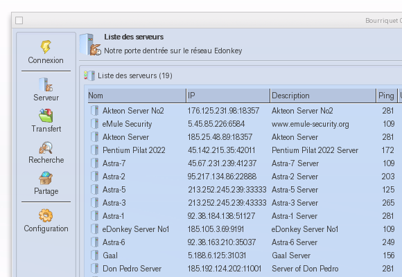

# &nbsp;

# ENGLISH VERSION 

Bourriquet is a free P2P file sharing application written for computer system MorphOS. 
It supports a configurable user interface based on the Magic User Interface (MUI) framework.

## Features

## Downloads/Releases

All releases up to the most current ones can be downloaded from our [central releases management](https://github.com/digitallytechno/bourriquet/releases). 

## Contributing

There are several ways how you can potentially contribute to this project. One important way to contribute to Bourriquet is to actually *report bugs/issues* you might identify. In addition you can also bring up feature/enhancements requests by using our [central issue tracker](https://github.com/digitallytechno/bourriquet/issues). Another way is to *help us translating* the user interface to a wide range of different languages by actually contributing your translations at the [transifex project pages](https://www.transifex.com/ato/bourriquet/) we are maintaining to manage all translations.  

## Development

Contributing your own code/modifications to Bourriquet is quite straight forward since you can use the nice resources of GitHub and submit your changes in terms of [pull requests](https://github.com/digitallytechno/bourriquet/pulls). If you, however, feel you might be better suited by joining our development team directly and you would like to directly submit your changes to this code repository we could easily provide you direct write access.

## License & Copyright

Bourriquet is distributed and license under the GNU General Public License Version 2. See [COPYING](COPYING) for more detailed information.

## Authors / Contributors

See [contributors list](https://github.com/digitallytechno/bourriquet/graphs/contributors) for all contributions over all years.

# VERSION FRANÇAISE ########################################################################################################################

Bourriquet est une application libre de partage de fichiers P2P écrite pour le système MorphOS. Il supporte une interface utilisateur configurable basée sur le framework MUI (Magic User Interface).

## Caractéristiques

## Téléchargements et versions

Toutes les versions, jusqu'à la plus récente, peuvent être téléchargées à partir de notre [gestion centrale des versions] (https://github.com/digitallytechno/bourriquet/releases). 

## Contribuer

Il existe plusieurs façons de contribuer à ce projet. Une façon importante de contribuer à Bourriquet est de *reporter les bogues/problèmes* que vous pourriez identifier. De plus, vous pouvez également faire des demandes de fonctionnalités/améliorations en utilisant notre [central issue tracker] (https://github.com/digitallytechno/bourriquet/issues). Vous pouvez également nous aider à traduire l'interface utilisateur dans un grand nombre de langues différentes en contribuant à la traduction sur les [pages du projet transifex](https://www.transifex.com/ato/bourriquet/) que nous maintenons pour gérer toutes les traductions.  

## Développement

Contribuer à Bourriquet avec votre propre code/modifications est assez simple puisque vous pouvez utiliser les ressources de GitHub et soumettre vos changements en termes de [pull requests](https://github.com/digitallytechno/bourriquet/pulls). 

Cependant, si vous estimez qu'il est préférable de rejoindre directement notre équipe de développement et que vous souhaitez soumettre directement vos modifications à ce dépôt de code, nous pouvons facilement vous fournir un accès direct en écriture.

## Licence & Copyright

Bourriquet est distribué sous licence GNU General Public License Version 2. Voir [COPYING](COPYING) pour plus d'informations.

## Auteurs / Contributeurs

Voir [liste des contributeurs]
